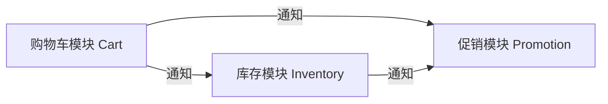
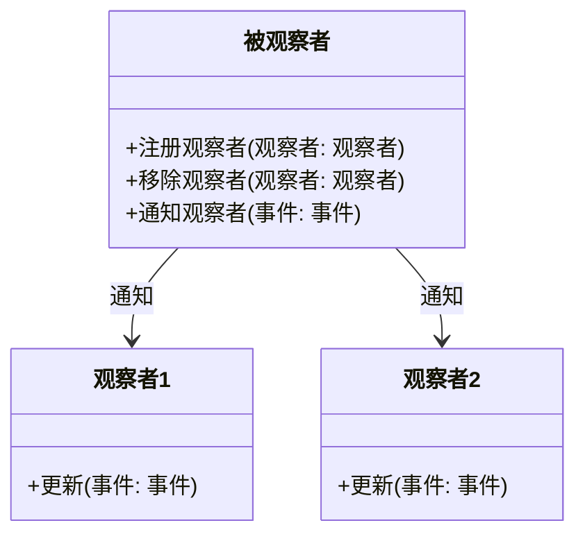
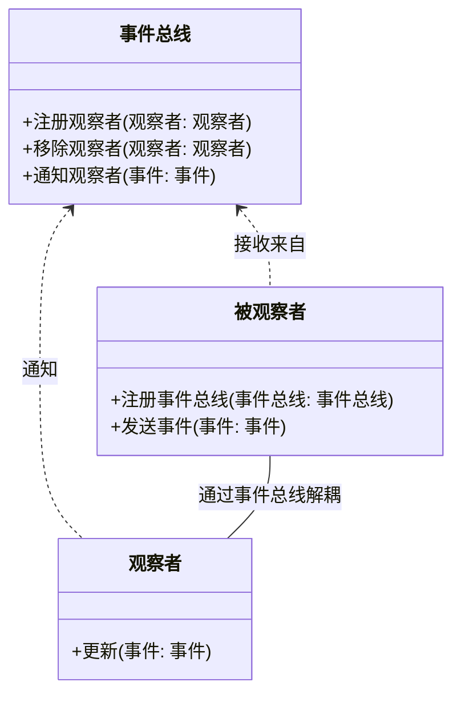
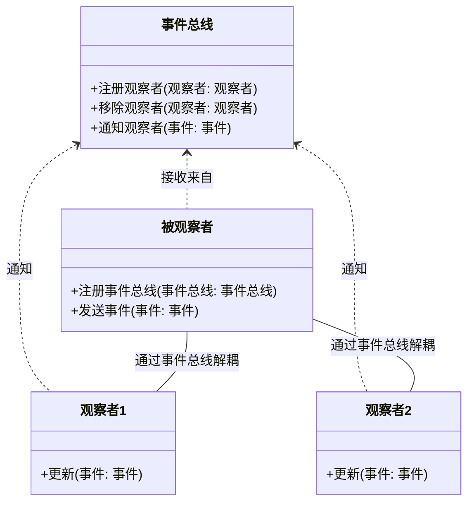
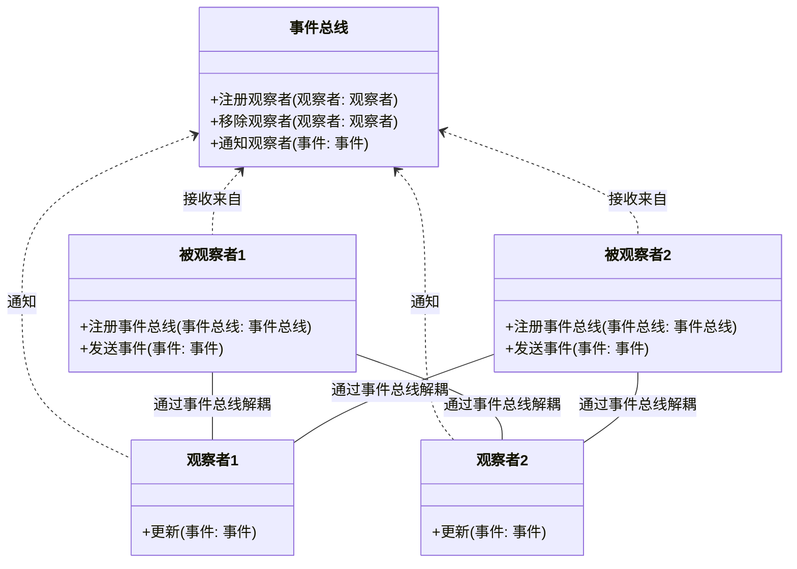

## 快速开始

安装依赖

```bash
npm install
# or
yarn
```

启动开发服务：

```bash
npm run dev
# or
yarn dev
# or
pnpm dev
```

## 访问页面

打开 [http://localhost:3000/demos/modal](http://localhost:3000/demos/modal) 查看页面。



---



---



---



---

